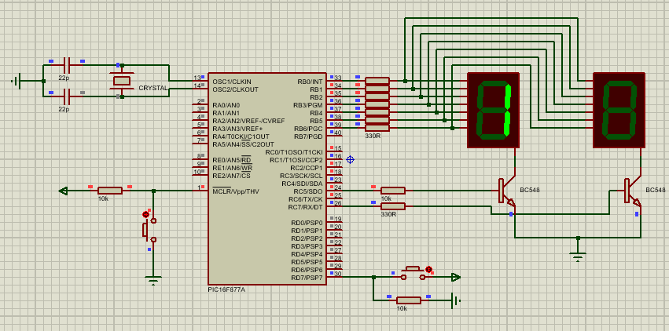

# `PIC16F877A` Control de un Contador Digital con Display de 7 Segmentos

Este proyecto utiliza un microcontrolador PIC16F877A para controlar un contador digital que se muestra en dos displays de 7 segmentos. El contador incrementa cada vez que se pulsa un botón y vuelve a 0 después de llegar a 99.

## Componentes
- Microcontrolador: PIC16F877A
- 2 Displays de 7 Segmentos
- Botón
- 2 Transistor 

## Herramientas de Desarrollo
- Proteus 11 para la simulación
- Lenguaje de programación: C

## Archivos del Proyecto
- `Código fuente` : "99_Pulsations.c"
- Archivo .hex para la programación del microcontrolador
- Archivo .cof para depuración

## Diagrama de Conexión
- Se incluye una imagen PNG que muestra el diagrama de conexión entre los componentes
- También se añade la simulación realizada en Proteus

## Licencia
Este proyecto está bajo la licencia MIT. Consulta el archivo `LICENSE` para obtener más detalles.

-----------------------------------------------
# `PIC16F877A` Digital Counter Control with 7-Segment Display

This project uses a PIC16F877A microcontroller to control a digital counter that is displayed on two 7-segment displays. The counter increments each time a button is pressed and returns to 0 after reaching 99.

## Components
- Microcontroller: PIC16F877A
- 2 7-Segment Displays
- Button
- 2 Transistors

## Development Tools
- Proteus 11 for simulation
- Programming language: C

## Project Files
- `Source code` : “99_Pulsations.c”
- .hex file for microcontroller programming
- .cof file for debugging

## Connection Diagram
- A PNG image is included that shows the connection diagram between the components
- The simulation performed in Proteus is also added

## License
This project is under the MIT license. Check the LICENSE file for more details.

-----------------------------------------------

 

